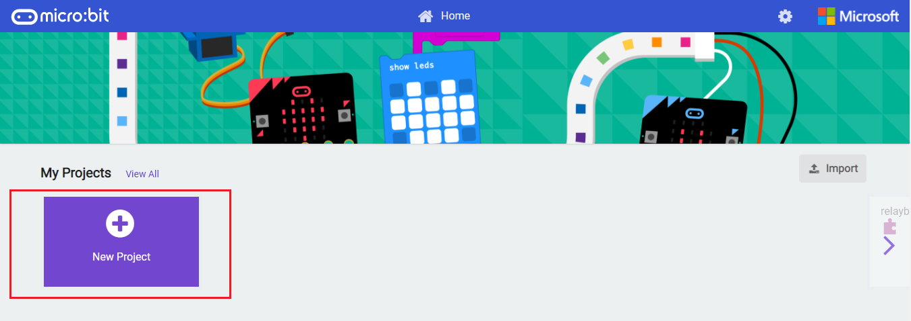
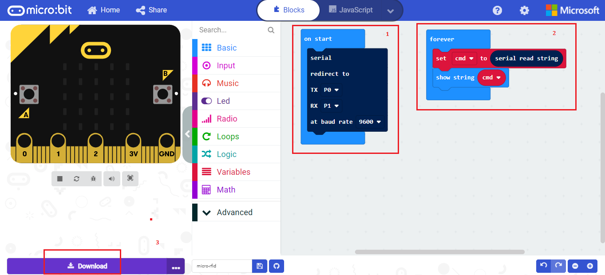

# RFID Expansion For Microbit

RFID Expansion for Micro:bit is an RFID device with an updated UART interface running at the frequency of 125KHz, Programmable Buzzer, two Dedicated slots for Servo Motor Interfacing.

## How to use ?

* Attach Microbit on stackable connector of RFID Expansion of Microbit as shown below.

* Visit official programming website of Microbit https://makecode.microbit.org/
* Now Create a new project by clicking on "New project" tab and enter name of your project. 

* Now drag and drop block as shown in below image and click on download button to download it on your Microbit.

* Tap RFID card, Keyfob or Tag on RFID receiver to show 12 digit unique id of card on led matrix of Microbit.

## Alternate Method :

* You can directly drag and drop test.hex file to Microbit to run above said program and Tap card/Tag to display their unique id on led matrix. 
